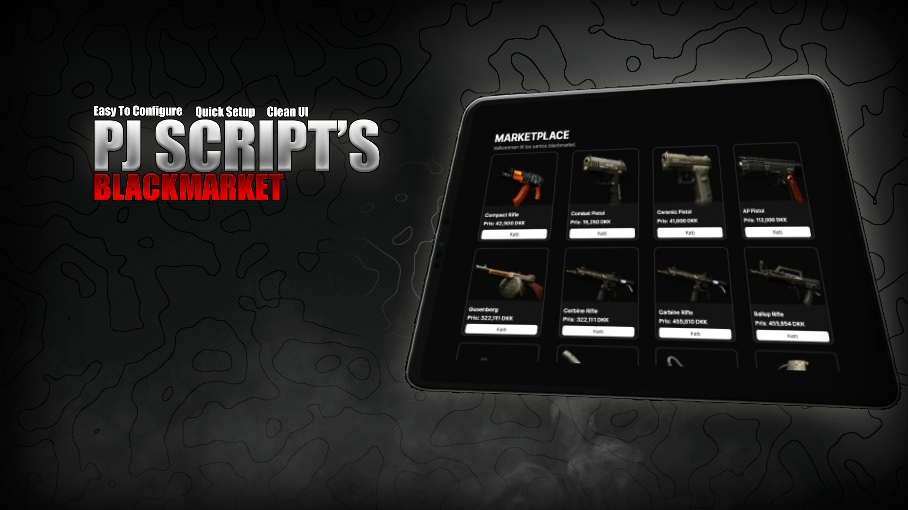

# pj-blackmarket

Velkommen til `pj-blackmarket` - en ressource til FiveM, der tilfører din FiveM-server et unikt BlackMarket Script.

Kontakt os: [https://discord.gg/c6fwDYEC2s](https://discord.gg/c6fwDYEC2s)

## Beskrivelse

Denne ressource muliggør en unik spilleroplevelse med blackmarket på din FiveM-server, hvor spillere kan købe forskellige genstande fra en sort markedshandler. Det inkluderer et brugergrænseflade (UI) for interaktion.

## Funktioner

- Sort marked UI præsenteret som en tablet.
- En pederstrian (ped), der fungerer som sort markedssælger.
- Integration med ESX for styring af spillerkonti.

## Installation

1. **Automatisk implementering:**
    - Clone dette repository eller download det som en zip.
    - Udpak zip-filen (hvis du har downloadet den som en zip).
    - Flyt mappen `pj-blackmarket` til din resources-mappe.
    - Tilføj `ensure pj-blackmarket` til din server.cfg.
    - Opdater ui_page url i fxmanifest.lua til din url.
    - Rediger config.lua efter dine præferencer.
    - Start din server.

2. **Manuel implementering:**
    - Clone dette repository eller download det som en zip.
    - Udpak zip-filen (hvis du har downloadet den som en zip).
    - Gå til mappen `ui`.
    - Kør `npm install` eller `yarn install` eller `pnpm install` for at installere afhængighederne.
    - Kør `npm run build` eller `yarn build` eller `pnpm build` for at bygge projektet.
    - Kør `npm run start` eller `yarn start` eller `pnpm start` for at starte projektet.
    - Opdater ui_page url i fxmanifest.lua til din url.
    - Start din server.

## Konfiguration

### Config.lua

- `MarketPed`: Ped-modellen til sort markedssælgeren.
- `randomLocation`: Koordinater og retning for det tilfældige sted for sort marked.
- `Items`: Konfiguration for de genstande, der er tilgængelige på det sorte marked.

### Webhook-konfiguration

Opdater `WebhookLink` i serversiden med den ønskede Discord-webhook til logging.

## Brug

1. Spillere kan interagere med det sorte marked ved at nærme sig peden eller bruge en angiven tast.
2. Det sorte marked UI viser tilgængelige genstande, priser og kategorier.
3. Spillere kan foretage køb gennem UI'en.

## Notifikationer

Spillere modtager notifikationer om vellykkede køb, utilstrækkelige midler og andre relevante begivenheder.

## Bidrag

Hvis du ønsker at bidrage til dette projekt, er du velkommen til at sende pull requests.

## Licens

Dette projekt er licenseret under MIT-licensen

